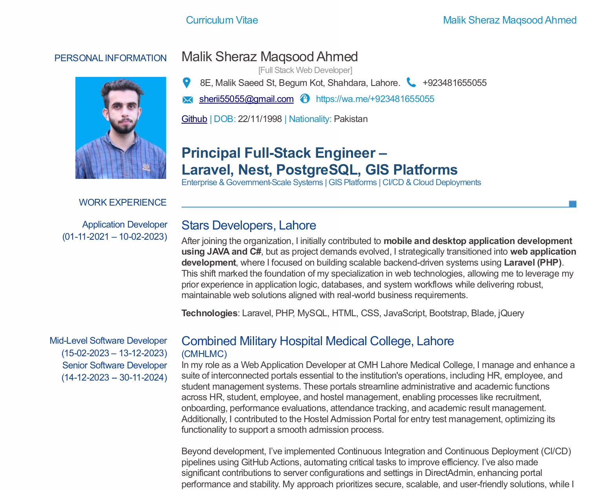

<h1><b>Hi , I'm Sheraz Maqsood </b></h1>
## <b>السَّلاَمُ عَلَيْكُمْ وَرَحْمَةُ اللهِ وَبَرَكَاتُهُ...✨</b>

  

  
 

## <b>📄 My Resume / CV</b>

  

 
 
<!--- snake -->

  </a>

<picture> </picture>

<!--h2 without bottom border-->

  <ul align="center">
    
<h2 style="display: inline-block">Confusion is part of Programming</h2>

  </ul>

 

	
## <picture></picture> **About me**

<picture> </picture>

 

👋 Greetings! I'm Sheraz Maqsood.

🌟 Passionate about the art of web development, I embark on digital journeys to craft seamless online experiences. With a deep love for elegant code and pixel-perfect designs, I breathe life into the virtual realm.

💡 My Expertise:
- 🚀 Crafting web applications with Laravel, CodeIgniter and Core PHP.
- 🎨 Designing captivating user interfaces with Bootstrap and Vue.js.
- 🌐 Building responsive and accessible websites with HTML, CSS, and JavaScript.
- 🌟 Adding the magic touch of interactivity to projects.
- 💼 Harnessing the power of Electron.js for cross-platform desktop apps.
- 🪟 Creating Windows Form applications for intuitive user experiences.

🌱 I believe in the power of continuous learning. In this ever-evolving tech landscape, I'm always exploring new horizons to stay ahead of the curve.

💬 Let's Collaborate:
- 🌐 Open to exciting collaborations that push the boundaries of web development.
- 📫 Reach out to me if you share a passion for innovation and craftsmanship.

🔗 Connect with me:
- 🌐 Explore my code and contributions on GitHub.
- 💼 Connect on LinkedIn to expand our professional network.

🌟 Join me on this journey as we transform ideas into digital realities, one line of code at a time. Together, we'll create digital magic!

#WebDeveloper #CodeArtist #InnovationEnthusiast #PixelPerfectionist

- A passionate Self-taught backend developer
- Currently working as a Web Developer
<!--- Personal website [link](https://www.itsansoft.com)
- I’m currently open for an Intern or a new job opportunity, this is [my resume](https://read.cv/sherazmaqsood)
-->

 

## <b> Skills</b>
 
<!--h1 without bottom border-->

  <ul align="center">
    
<h2 style="display: inline-block">Technologies That I Know👨🏻‍💻</h2>

  </ul>

<!--tech stack icons-->

  

 

<!--

- **Languages**:
    
    
    
    

    
    
- **Front-End Development**:

   
   
   

 

- **Cloud Hosting**:

    
    
 

- **Softwares and Tools**:

    
    
    
    
     

 

- **Extras**:

    
       

 
-->
-----

 
 

## <b> Let's Connect..!</b>
 

<ul>

<li>

</li>

 

<li>

</li>
	
</ul>

 

 

 

<!---
Sheraz-Maqsood/Sheraz-Maqsood is a ✨ special ✨ repository because its `README.md` (this file) appears on your GitHub profile.
You can click the Preview link to take a look at your changes.
--->
